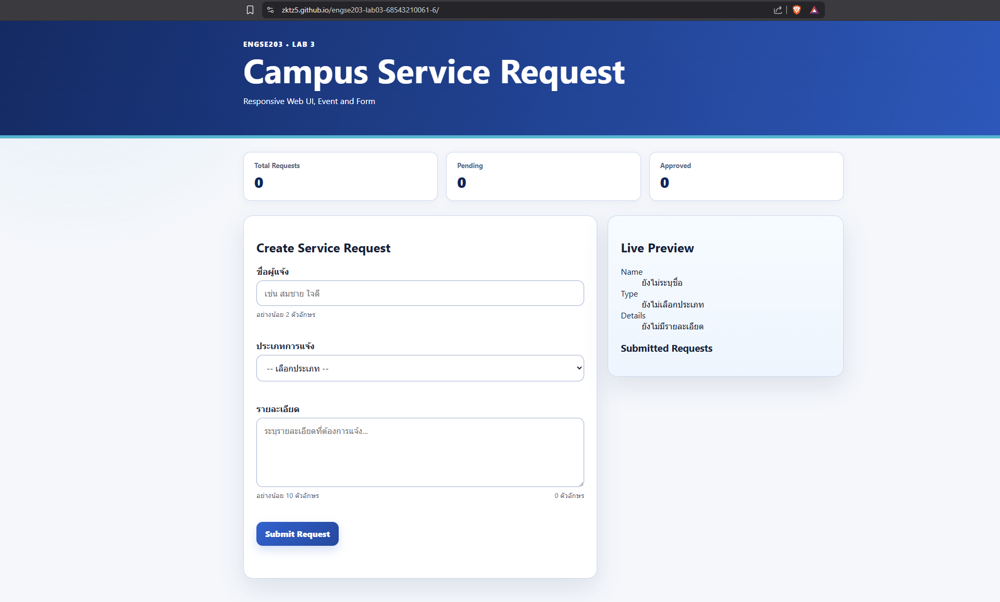
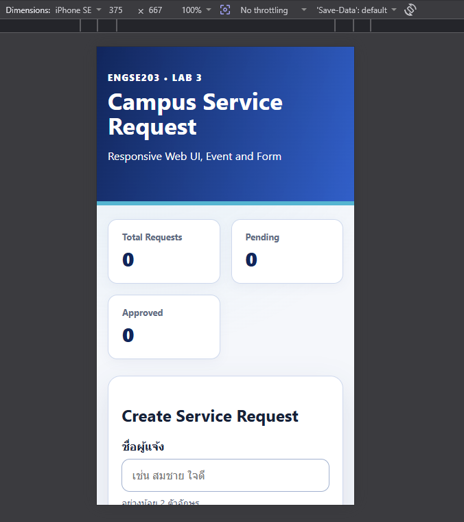
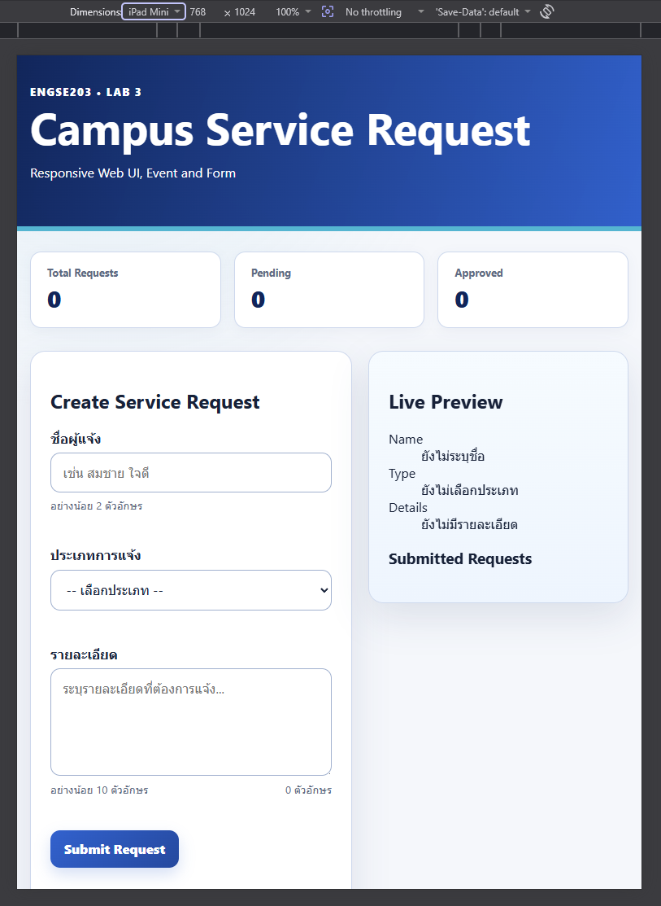
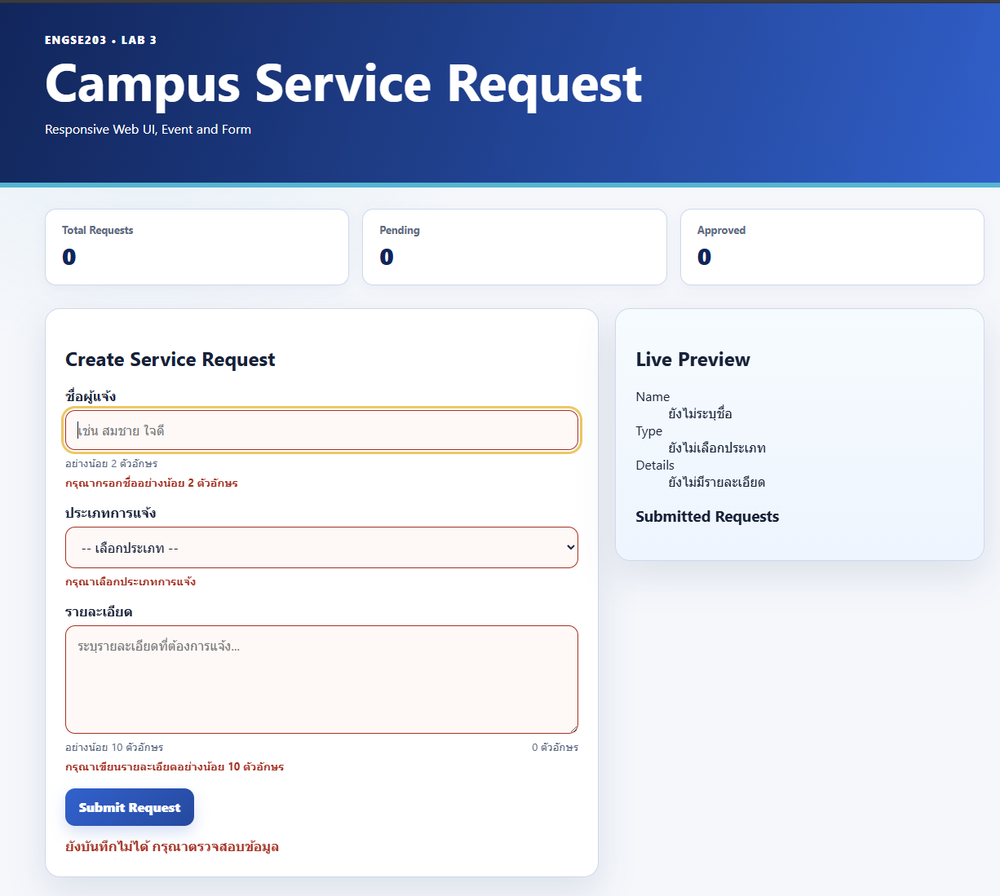
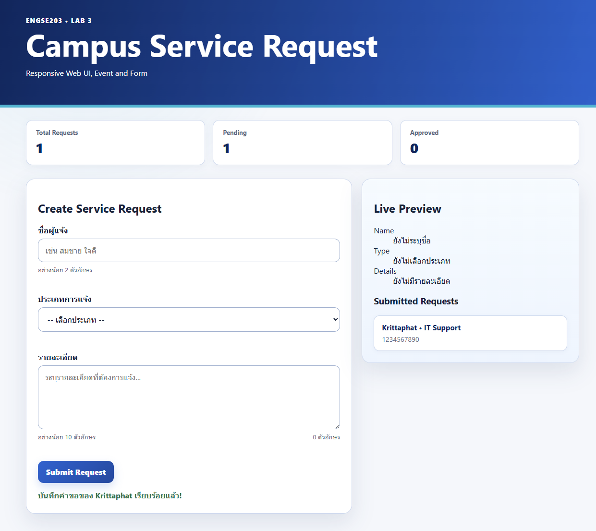

# ENGSE203 LAB 03 — Campus Service Request Form

## ผู้จัดทำ

- ชื่อ-นามสกุล: กฤตภาส มงคลคลี
- รหัสนักศึกษา: 68543210061-6
- ระบบปฏิบัติการที่ใช้: Windows / WSL

## วัตถุประสงค์ของงาน

- ฝึกวางโครงสร้าง Responsive ให้หน้าจอปรับเป็น 1 คอลัมน์บนมือถือ และ 2 คอลัมน์บนคอมด้วย Grid กับ Flexbox
- ใช้ JavaScript ดักจับ Event เพื่ออัปเดตข้อมูลพรีวิวให้เห็นทันทีตอนที่กำลังพิมพ์
- เขียนระบบตรวจเช็กฟอร์ม (Validation) ให้มีแจ้งเตือนเวลากรอกผิด โดยที่ข้อมูลที่เคยกรอกไว้ไม่หลุดหาย
- ส่งงานผ่าน Git Workflow โดยเริ่มตั้งแต่สร้าง Branch, ทำ Commit, รวมโค้ดด้วย Pull Request จนถึง Deploy ขึ้น GitHub Pages

## เครื่องมือที่ใช้

- HTML5 / CSS3 / JavaScript (ES6+)
- Vite (Build Tool)
- Git & GitHub
- Visual Studio Code (WSL Extension)

## วิธีติดตั้งและรัน

```bash
# สลับใช้ Node.js v22 ตามข้อกำหนดของรายวิชา
nvm use 22

# ติดตั้ง Dependencies
npm install

# รัน Development Server
npm run dev

# Build โครงงานเพื่อเตรียม Deploy
npm run build


## โครงสร้างไฟล์

.
├── src/
│   ├── main.js
│   └── style.css
├── .gitignore
├── index.html
├── package-lock.json
├── package.json
├── README.md
└── vite.config.js
```

## หลักฐานผลลัพธ์

อธิบายผลลัพธ์ พร้อมแนบภาพหน้าจอหรือข้อความผลลัพธ์ตามที่ใบงานกำหนด

### 1. หน้าเว็บ Desktop และ Live Preview


### 2. หน้าเว็บ Mobile (375px)


### 3. หน้าเว็บ Tablet (768px)


### 4. หน้าเว็บทดสอบ Validation


### 5. หน้าเว็บ Submitted

## ปัญหาที่พบและวิธีแก้ไข

| ปัญหาที่พบ | สาเหตุ / วิธีแก้ไข |
| :--- | :--- |
| 1. รันโปรเจกต์แล้วไฟล์ CSS/JS ไม่ถูกโหลด | **สาเหตุ:** ระบุ Path แบบ Absolute Path ผิดพลาด <br>**วิธีแก้:** ปรับ Path ใน `index.html` ให้เรียกผ่าน Vite Module `./src/main.js` |
| 2. เปิดไฟล์ `index.html` ตรงๆ แล้วสคริปต์ไม่ทำงาน | **สาเหตุ:** โครงงานใช้ ES Modules (`import './style.css'`) ซึ่งต้องรันผ่าน Web Server <br>**วิธีแก้:** รันโปรเจกต์ผ่านคำสั่ง `npm run dev` เท่านั้น |
| 3. Submit ฟอร์มแล้วหน้าเพจเกิดการ Reload | **สาเหตุ:** ไม่ได้ยกเลิก Default Behavior ของ Browser <br>**วิธีแก้:** เรียกใช้ `event.preventDefault()` ภายใน Submit Event Handler |

## References & AI Assistance

### Source / Documentation:
- MDN Web Docs: Semantic HTML, CSS Grid, Flexbox, Responsive Design, Events, FormData และ Constraint Validation
- WHATWG HTML Living Standard: Forms and interactive elements
- W3C Web Accessibility Initiative: Labels, Instructions, Validation, Keyboard Focus และ Status Messages
- Vite Documentation: Development server, build และ static deployment
- GitHub Docs: Branch, Pull Request และ GitHub Pages

### AI tool used:
- Google Gemini

### Used for:
- ช่วยตรวจสอบโครงสร้างภาษา JavaScript ในส่วนการทำ Form Validation และ Live Preview
- ให้คำแนะนำในการแก้ปัญหาสภาพแวดล้อมระบบการรัน (Vite Dev Server บน WSL2 / Terminal)
- ช่วยทำสำนวนเนื้อหาใน README.md ให้ถูกต้องตามหลักวิชาการ

### My adaptation:
- ปรับแก้ชื่อตัวแปร และผูก Event Handlers ให้ตรงกับ ID/Class ของหน้า HTML ในแล็บ
- ปรับแต่ง CSS จัด Responsive Layout, Visual Hierarchy และแก้ปัญหา UI กระโดด
- ทดสอบระบบบน Viewport 375px, 768px, 1280px ด้วยตนเอง