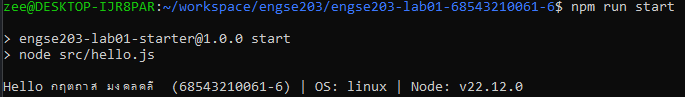

# ENGSE203 LAB 01 — Developer Environment & GitHub Repository Setup

## ผู้จัดทำ

- ชื่อ-นามสกุล: `กฤตถาส มงคลคลี`
- รหัสนักศึกษา: `68543210061-6`
- ระบบปฏิบัติการที่ใช้: Windows

## วิธีรัน

```bash
npm run start
```

## ผลลัพธ์ที่คาดหวัง

โปรแกรมต้องแสดงชื่อ รหัสนักศึกษา ระบบปฏิบัติการ และ Node.js version

## หลักฐานผลลัพธ์



## References & AI Assistance

- Source / Documentation:
- AI tool used:
- Used for:
- My adaptation: