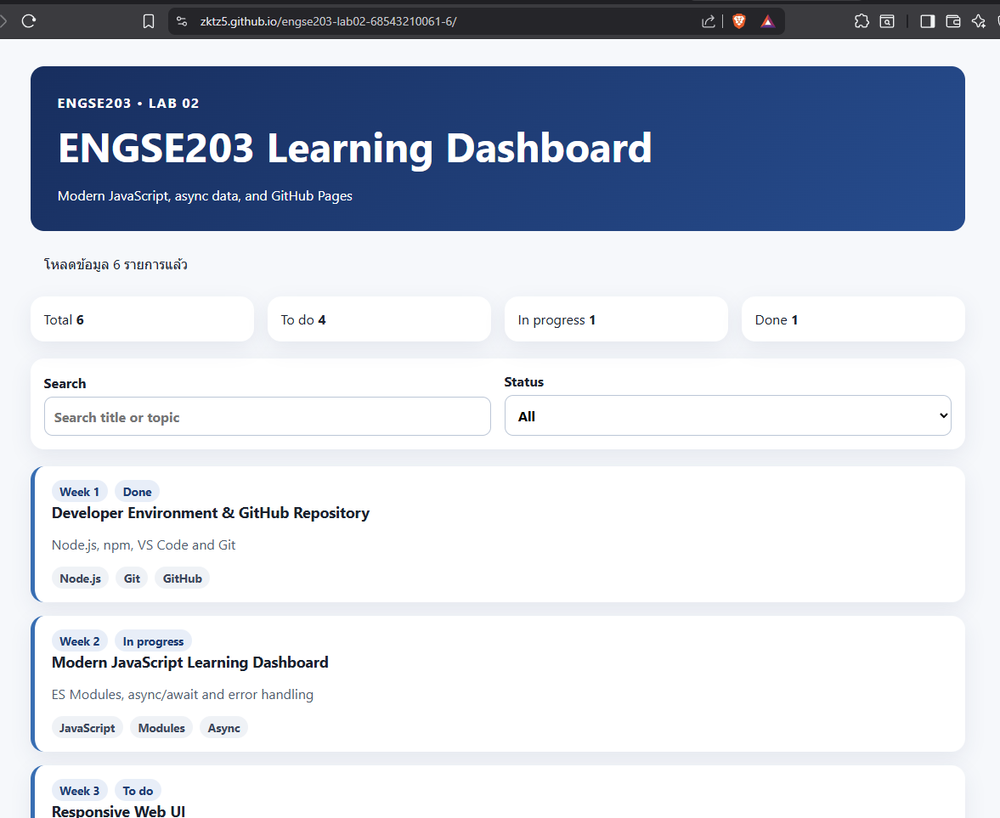
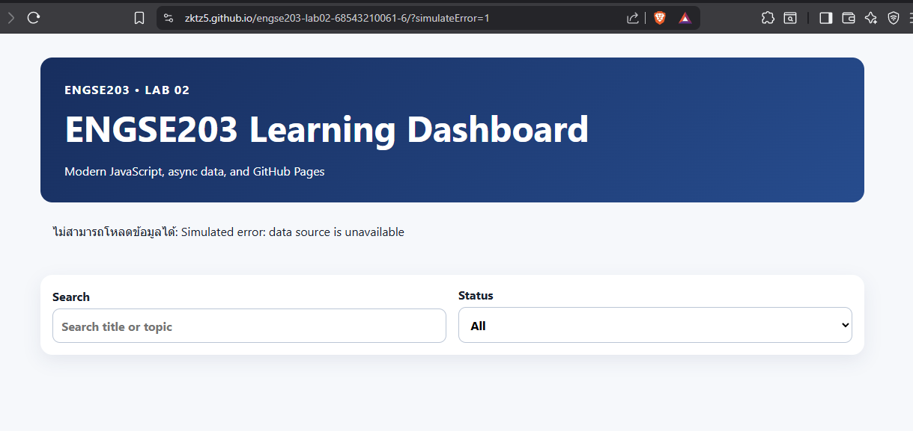

# ENGSE203 LAB 02 — Modern JavaScript Dashboard

## ผู้จัดทำ

- Student ID: `68543210061-6`

- Name: `นาย กฤตถาส มงคลคลี`

- Operating system: `Windows + WSL`

- URL GitHub repository: `https://github.com/ZKTz5/engse203-lab02-68543210061-6`

- GitHub Pages URL: `https://zktz5.github.io/engse203-lab02-68543210061-6/`

- URL Pull Request: `https://github.com/ZKTz5/engse203-lab02-68543210061-6/pull/1`
---

## คำอธิบายโครงงาน

เว็บแอปพลิเคชัน ENGSE203 Learning Dashboard เป็นระบบแสดงรายการแผนการเรียนรู้และงานฝึกปฏิบัติของรายวิชา พัฒนาโดยใช้ Vanilla JavaScript (ES6+) ร่วมกับ Vite

โครงงานนี้มุ่งเน้นการจัดโครงสร้างโค้ดแบบ ES Modules ที่แยกหน้าที่ชัดเจน (api, utils, ui, main) และรองรับการดึงข้อมูล JSON แบบ Async ด้วย fetch พร้อมระบบค้นหา คัดกรองสถานะ และคำนวณสถิติภาพรวม รวมถึงมีการจัดการข้อผิดพลาดด้วย try/catch/finally เพื่อแสดง Error State ป้องกันปัญหาหน้าจอขาว (Blank Page) เมื่อระบบเกิดข้อผิดพลาด

---

## วิธีติดตั้งและรัน

    -npm install โหลดโฟลเดอร์ node_modules มาไว้ในเครื่องครั้งแรก

    -npm run dev เปิดเซิร์ฟเวอร์จำลองเพื่อเขียนโค้ดไปดูผลลัพธ์ไป

    -npm run check เช็คโครงสร้างไฟล์

    -npm run build สร้างโฟลเดอร์ docs/

---

## GitHub Pages URL

    https://zktz5.github.io/engse203-lab02-68543210061-6/

---

## ภาพหน้าจอ normal state และ error state

### Normal State

    
### Error State

---

## ปัญหาที่พบและวิธีแก้

| ปัญหาที่พบ | สาเหตุ | วิธีแก้ไข |
| :--- | :--- | :--- |
| **หน้าเว็บขึ้น 404 Not Found เมื่อเติม `simulateError=1`** | พิมพ์รูปแบบ URL ผิดพลาดโดยใช้เครื่องหมายสแลช (`/simulateError=1`) ทำให้เว็บเซิร์ฟเวอร์มองหาโฟลเดอร์หรือไฟล์ที่ไม่มีอยู่จริง | เปลี่ยนไปใช้เครื่องหมายคำถาม (`?`) เพื่อส่งค่าในรูปแบบ Query String ให้ถูกต้องตามโครงสร้างการรับค่าของระบบ คือ `?simulateError=1` |
| **Assets (CSS/JS) หรือไฟล์ JSON ขึ้น 404 บน GitHub Pages** | การตั้งค่าพาธเริ่มต้น (Base Path) ในไฟล์ `vite.config.js` ไม่ตรงกับชื่อ Repository จริงบน GitHub ทำให้ระบบอ้างอิงตำแหน่งไฟล์ผิดพลาด | แก้ไขตัวแปร `repositoryName` ใน `vite.config.js` ให้ตรงกับชื่อคลังข้อมูล (`engse203-lab02-68543210061-6`) จากนั้นรันคำสั่ง `npm run build` ใหม่ แล้วทำการ Commit โฟลเดอร์ `docs/` อัปเดตขึ้นระบบ |
| **หน้าเว็บบน GitHub Pages ไม่เปลี่ยนแปลงหลังจากแก้ไขโค้ด** | ลืมรันสคริปต์คอมไพล์โปรเจกต์ก่อนส่งงาน ทำให้ไฟล์ที่อยู่ภายในโฟลเดอร์ `docs/` ยังคงเป็นโค้ดเวอร์ชันเก่า | ทุกครั้งที่มีการปรับปรุงโค้ดในโฟลเดอร์ `src/` จะต้องรันคำสั่ง `npm run build` เพื่ออัปเดตไฟล์ในโฟลเดอร์ `docs/` ก่อนสั่ง `git push` เสมอ |

---

## References & AI Assistance

### References

-[async-await_and_error-handling.md](https://github.com/se-rmutl/engse203-lab/blob/main/labs/week-02-modern-javascript/docs/async-await_and_error-handling.md)

-[destructuring_array_map_filter_reduce.md](https://github.com/se-rmutl/engse203-lab/blob/main/labs/week-02-modern-javascript/docs/destructuring_array_map_filter_reduce.md)

-[functions_and_invocation.md](https://github.com/se-rmutl/engse203-lab/blob/main/labs/week-02-modern-javascript/docs/functions_and_invocation.md)

-[variable_naming.md](https://github.com/se-rmutl/engse203-lab/blob/main/labs/week-02-modern-javascript/docs/variable_naming.md)

### AI Assistance

-Google Gemini